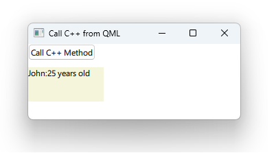

# Notes to self
        . Exploring communication between C++ and QML using ContextProperties :

        . Setup :
            . Create a CppWorker class
            . Inherit QObject
            . Use the Q_OBJECT macro
                 . decorate methods with Q_INVOKABLE : They become callable from QML
                 . or just make them public slots : They become callable from QML
            . Include QQmlContext in main.cpp
            . Expose the class as a context property :
                . engine.rootContext()->setContextProperty("BWorker",&worker);

            . The context property is available not only in the main.qml file but through
                out all your QML code. It's hosted by the qml engine that runs your qml code.
                So we can use our C++ code in :
                    . main.qml : show this
                    . Other.qml : Show this.

       
---

# Context Properties : Call C++ from QML


---

# cppworker.h
```c++
#ifndef CPPWORKER_H
#define CPPWORKER_H

#include <QObject>

class CppWorker : public QObject
{
    Q_OBJECT
public:
    explicit CppWorker(QObject *parent = nullptr);
    Q_INVOKABLE void regularMethod(); //Callable from QML
    Q_INVOKABLE QString regularMethodWithReturn(QString name, int age);//Callable from QML
public slots:
    void cppSlot(); // Callable from QML
};

#endif // CPPWORKER_H
```
---

# cppworker.cpp
```C++
#include <QDebug>
#include "cppworker.h"

CppWorker::CppWorker(QObject *parent) : QObject(parent){}

void CppWorker::regularMethod()
{
    qDebug() << "This is C++ talking, regularMethod called.";
}

QString CppWorker::regularMethodWithReturn(QString name, int age)
{
    return QString(name + ":"+ QString::number(age) + " years old");
}

void CppWorker::cppSlot()
{
    qDebug() << "This is C++ talking, cppSlot called.";
}
```
---

# main.cpp : Expose to QML
```c++
#include <QQmlApplicationEngine>
#include "cppworker.h"

int main(int argc, char *argv[])
{
    QGuiApplication app(argc, argv);
    CppWorker worker;
    QQmlApplicationEngine engine;

    //Expose the C++ type to QML as a Context Property
    engine.rootContext()->setContextProperty("BWorker",&worker);

    const QUrl url(u"qrc:/2-ContextProperties/main.qml"_qs);
    engine.load(url);
    return app.exec();
}
```
---

# main.qml : Use the C++ type in QML
```qml
    Column {
            Button{
                text : "Call C++ Method"
                onClicked: {
                    BWorker.regularMethod()
                    BWorker.cppSlot()
                }
            }
            Rectangle {
                width: textToShowId.implicitWidth + 20
                height: 50
                color: "beige"
                Text{
                    id : textToShowId
                    text : BWorker.regularMethodWithReturn("John", 25)
                }
            }
    }
```


