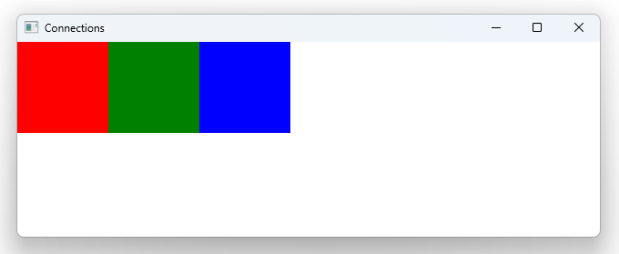

# Notes to self
        . Exploring the Connections type :
            . It's used to hijcak signals from other components
            . In this example , green and blue rect are hijacking signals
                from the red rect and handling them.
            . The component you hijack from must possess the signal handled by
                the Connections block.
          . Improvise :
            . In Qt 6 it's advised to explicitly define the handler like so :
                Connections{
                    target: redRectMouseAreaId
                    function onClicked() {
                        console.log("This is blue rect responding")
                    }

                }

       
---

# QML Connections Type


---

```qml
           Rectangle{
                id : redRect
                width: 100
                height: 100
                color: "red"
            }

            Rectangle{
                id : greenRect
                width: 100
                height: 100
                color: "green"

                Connections{
                    target: redRectMouseAreaId
                    function onClicked (){
                        console.log("This is green rect responding")
                    }
                }
            }
```


