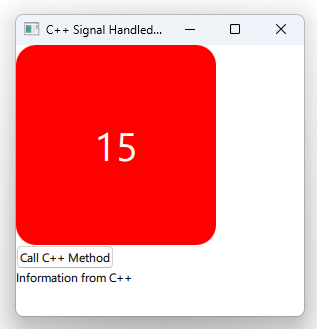

# Notes to self
        . Using the Connections element to handle signals comming
                from exposed context properties from the C++ side.

        . Start with callQML to make things a bit simpler
        . Then use the timer to let the thing take off
            on its own.
       
---

# Handling C++ Signals in QML


---

# Signal Sender : Header
```c++
#include <QObject>
#include <QTimer>

class CppSignalSender : public QObject
{
    Q_OBJECT
public:
    explicit CppSignalSender(QObject *parent = nullptr);
signals:
    void callQml(QString parameter);
    void cppTimer(QString value);
public slots:
    void cppSlot();
private:
    QTimer * mTimer;
    int mValue;
};
```

---

# Signal Sender : Implementation
```c++
#include "cppsignalsender.h"

CppSignalSender::CppSignalSender(QObject *parent) : QObject(parent),mTimer(new QTimer(this)),mValue(0)
{
    connect(mTimer,&QTimer::timeout,[=](){
        ++mValue;
        emit cppTimer(QString::number(mValue));
    });
    mTimer->start(1000);

}

void CppSignalSender::cppSlot()
{
    emit callQml("Information from C++");
}
```

---

# main.cpp
```c++
int main(int argc, char *argv[])
{
    QGuiApplication app(argc, argv);
    QQmlApplicationEngine engine;
    CppSignalSender sender;

    //Expose the C++ type to QML
    engine.rootContext()->setContextProperty("CppSignalSender",&sender);

    const QUrl url(u"qrc:/4-CppSignal/main.qml"_qs);
    engine.load(url);
    return app.exec();
}

```
---

# main.qml
```qml
    Connections{
        target: CppSignalSender
        function onCallQml (parameter) {
            console.log("This is QML : callQml signal cought")
            mText.text = parameter;
        }

        function onCppTimer(value) {
            mRectText.text = value;
        }
    }


```


