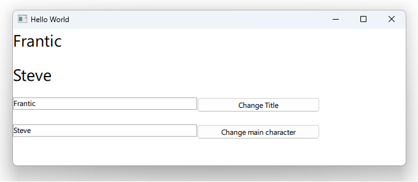

# Notes to self
    . Exploring how to use the QPROPERTY mechanism to propagate data back and
        forth between C++ and QML
            . You set up the QPROPERTY macros :
                Q_PROPERTY(QString mainCharacter READ mainCharacter WRITE setMainCharacter NOTIFY mainCharacterChanged)
                Q_PROPERTY(QString title READ title WRITE setTitle NOTIFY titleChanged)

            . You set up the necessary members, setters, getters and signals :
                    . See movie.h

            . You expose the movie class as a context property

            . And use it in QML

     . Problem :
            . errors when the app dies :
                .       TypeError: Cannot read property 'mainCharacter' of null
                        TypeError: Cannot read property 'title' of null

            . This suggests that our QML may be reading from an already dead movie object
                in the sequence of events when the app dies off.

            . One could mess with the qml engine and possibly solve this, but I opt to
                just check to see if we have a lively movie object before reading from
                    it in our code (I had to google around to put the js for this together ;-) :

                         text : Movie === null ? "" : Movie.mainCharacter
                        //text : Movie.mainCharacter


            . Show that if you don't emit the changed signals, the data won't update, because
                consumer objects rely on them to fetch the new data.
       
---

# The Q_PROPERTY Mechanism


---

# movie.h
```c++
class Movie : public QObject
{
    Q_OBJECT
    Q_PROPERTY(QString mainCharacter READ mainCharacter WRITE setMainCharacter NOTIFY mainCharacterChanged)
    Q_PROPERTY(QString title READ title WRITE setTitle NOTIFY titleChanged)
public:
    explicit Movie(QObject *parent = nullptr);
    QString mainCharacter() const;
    void setMainCharacter(QString mainCharacter);
    QString title() const;
    void setTitle(QString title);
signals:
    void mainCharacterChanged(QString mainCharacter);
    void titleChanged(QString title);
private:
    QString m_title;
    QString m_mainCharacter;
};
```
---

# movie.cpp
```c++
Movie::Movie(QObject *parent) : QObject(parent),m_title("Movie Title"),m_mainCharacter("Main Character"){}

QString Movie::mainCharacter() const{ return m_mainCharacter;}

void Movie::setMainCharacter(QString mainCharacter){
    if (m_mainCharacter == mainCharacter)
        return;
    m_mainCharacter = mainCharacter;
    emit mainCharacterChanged(m_mainCharacter);
}

QString Movie::title() const{
    return m_title;
}

void Movie::setTitle(QString title)
{
    if (m_title == title)
        return;
    m_title = title;
    emit titleChanged(m_title);
}
```
---

# main.cpp
```c++
int main(int argc, char *argv[])
{
    QGuiApplication app(argc, argv);
    QQmlApplicationEngine engine;

    //Create the c++ object on the stack
    Movie movie;
    movie.setTitle("Titanic");
    movie.setMainCharacter("Leonardo D");

    //Expose the C++ object to QML
    engine.rootContext()->setContextProperty("Movie",&movie);

    const QUrl url(u"qrc:/5-QPROPERTYMapping/main.qml"_qs);
    engine.load(url);
    return app.exec();
}
```
---

# main.qml : Read data through getters
```qml
        Text {
            id : titleId
            width: 500
            //text : Movie === null ? "" : Movie.title
            text : Movie.title
            font.pointSize: 20
        }


        Text {
            id : mainCharId
            width: 500
            //text : Movie === null ? "" : Movie.mainCharacter
            text : Movie.mainCharacter
            font.pointSize: 20
        }
```
---

# main.qml : Set data through setters
```qml
        Row {
            anchors.horizontalCenter: parent.horizontalCenter
            TextField{
                id : titleTextFieldId
                width: 300
            }
            Button {
                width: 200
                id : button1
                text : "Change Title"
                onClicked: {
                    Movie.title = titleTextFieldId.text
                }
            }
        }
```


