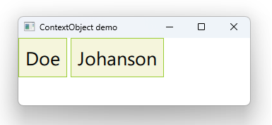

# Notes to self
        . Exploring Context objects
        . They allow you to expose properties in one go
        . The properties are wrapped in a class and each one
            is modeled as a QPROPERTY.
        . You expose the wrapper object and all nested properties
            are available in QML

        . Flow :
            . use context properties to expose last name and firstname
            . Make it work in qml
            . Change to use context objects
            . Set up a timer to show how changes on the C++ side are automatically
                propagated to the QML side
        . Compare context properties to context object :
            . with contextobject , all properties are managed under one object
            . Because we're using the QPROPERTY machinery, changes propagate automatically
            . You'll find what suits you better as  you use these things in projects.

        . Steal ideas from your video course for QT5 if necessary.      
---

# Context Objects


---


```c++
class PropertyWrapper : public QObject
{
    Q_OBJECT
    Q_PROPERTY(QString lastname READ lastname WRITE setLastname NOTIFY lastnameChanged)
    Q_PROPERTY(QString firstname READ firstname WRITE setFirstname NOTIFY firstnameChanged)
public:
    explicit PropertyWrapper(QObject *parent = nullptr);
    QString lastname() const;
    QString firstname() const;
    void setLastname(QString lastname);
    void setFirstname(QString firstname);
signals:
    void lastnameChanged(QString lastname);
    void firstnameChanged(QString firstname);
private:
    QString m_lastname;
    QString m_firstname;
    QTimer * m_timer;
    int m_random_number;
};
```

---

# main.cpp
```c++
int main(int argc, char *argv[])
{
    QGuiApplication app(argc, argv);
    QQmlApplicationEngine engine;

    //Create the C++ type
    PropertyWrapper propWrapper;
    propWrapper.setLastname("Doe");
    propWrapper.setFirstname("John");

    //Expose the C++ type to QML
    engine.rootContext()->setContextObject(&propWrapper);

    const QUrl url(u"qrc:/6-ContextObjects/main.qml"_qs);
    engine.load(url);
    return app.exec();
}
```

---

# main.qml
```qml
    Rectangle {
           id : mRect1
           color: "beige"
           Text {
               id: mText1
               text: lastname
           }
       }

    Rectangle {
           id : mRect2
           color: "beige"
           Text {
               id: mText2
               text: firstname
           }
    }
```


