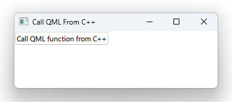

# Notes to self
        . Calling a js method from C++

        . The syntax :
            QMetaObject::invokeMethod(qmlRootObject,"qmlJSFunction",
                                      Q_RETURN_ARG(QVariant,returnedValue),
                                      Q_ARG(QVariant,cppParameter));

        .qmlRootObject is the element containing the function that you want to call,
            in this casse, the root element
        . ATTENTION : In this case, we're just interested in functions living in
            the root element, we'll see about others later on in the course.

        . We pick up the correct root object in main.cpp :
                if (engine.rootObjects().isEmpty()){
                   return -1;
                }else{
                    //--!!!!!!!Should make sure this is SET !!!!!!!!!!!!!!--
                    jsCaller.setQmlRootObject(rootObjcts[0]);
                }    
---

# Call JS from C++


---


# Call JS from C++
```c++
    QVariant returnedValue;
    QVariant cppParameter = QVariant::fromValue(param);

    QMetaObject::invokeMethod(qmlRootObject,"qmlJSFunction",
                              Q_RETURN_ARG(QVariant,returnedValue),
                              Q_ARG(QVariant,cppParameter));

     qDebug() << "C++ talking, done calling QML Javascript, the return value is :"
              << returnedValue.toString();
```


