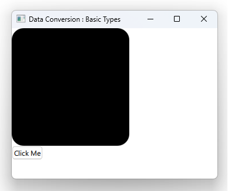

# Notes to self
    . Exploring the exchange of data between C++ and QML
    . We do that by sending signals across the two sides and seeing
        what we receive on the other end
    . Improvise and learn from the Qt 5 course.

       
---

# C++ and QML : Data Exchange


---

# Sending data from C++
```c++
void CppClass::cppSlot()
{
    emit sendInt(123);
    emit sendDouble(123.45);
    emit sendBoolRealFloat(true,34.12,456.2);
    emit sendStringUrl("String from C++",QUrl("http://www.blikoontech.com"));
    emit sendColorFont(QColor(123,20,30),QFont("Times", 20, QFont::Bold));
    emit sendDate(QDate (1995, 4, 17));
    emit sendDate(QDate::currentDate());
    emit sendPoint(QPoint(100,200),QPointF(45.54,87.34));
    emit sendSize(QSize(200,500),QSizeF(200.45,500.45));
    emit sendRect(QRect(100,100,300,300),QRectF(105.5,105.5,200.4,200.4));

}
```
---

# Receive data in QML
```qml
       Connections {
           target: CppClass

           function onSendInt (param) {
               console.log("Received int :" + param + " , type is :" + typeof param)
           }

           function onSendDouble (doubleParam) {
               console.log("Received double :" + doubleParam + " , type is :" + typeof doubleParam)
           }
         //...
       }
```

---

# Send data from QML
```qml
       Button{
           id : mButton
           anchors.top: mRect.bottom
           text : "Click Me"
           onClicked: {
               //CppClass.receivePoint(Qt.point(200,300))
               CppClass.receiveRect(Qt.rect(40.10,40,100,100))
           }
       }
```

---

# Receive data in C++
```C++
void CppClass::receivePoint(QPoint point)
{
    qDebug() << "Received point from QML :" << point ;
}

void CppClass::receiveRect(QRectF rect)
{
    qDebug() << "Received rect from QML :" << rect ;
}
```


