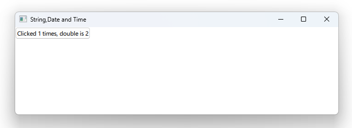

# Notes to self
        . Some localization facilities for
            . date
            . datetime
            . strings
            . currency
        . Precision for number outpu
---

# Date,Time and String Localization Facilities

---

# Notes to Self
* No need to show the app screenshot for this lecture
* Just describe what's to be done and use the docs
* The image on the next slide is just so other lectures can steal the syntax.

       
---

# xxx

