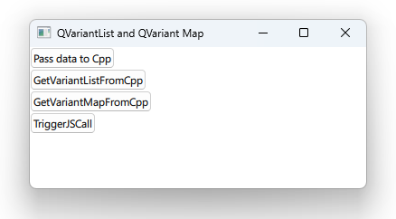

# Notes to self
    . Exploring the use of QVariantList and QVariantMap to pass sequence data
        back and forth between C++ and QML

            . QVariantList (C++) <=> array (QML)
            . QVariantMap (C++) <=> object (QML)

    . We
            . pass data from qml to c++
                 void CppClass::passFromQmlToCpp(QVariantList list/, QVariantMap map )
            . getVariantListFromCpp();
            . getVariantMapFromCpp()
            . Invoke a js method by passing in sequence data :
                . CppClass::triggerJSCall()

    . Use the qt 5 course and improvise.
---

# VariantList and VariantMap


---

# QML : array and object
```qml
    Button{
        id : button1
        text : "Pass data to Cpp"
        onClicked: {
            var arr = ['Africa','Asia',"Europe","North America","South America","Oceania","Antarctica"]
            var obj = {
                firstName:"John",
                lastName:"Doe",
                location:"Earth"
            }

            CppClass.passFromQmlToCpp(arr,obj);
        }

    }
```
     
---

# C++ : QVariantList and QVariantMap
```c++
void CppClass::passFromQmlToCpp(QVariantList list/*array*/, QVariantMap map /*object*/)
{
    qDebug() << "Received variant list and map from QML";
    qDebug() << "List :";
    for( int i{0} ; i < list.size(); i++)
    {
        qDebug() << "List item :" << list.at(i).toString();
    }


    qDebug() << "Map :";
    for( int i{0} ; i < map.keys().size(); i++)
    {
        qDebug() << "Map item :" << map[map.keys().at(i)].toString();
    }
}
```

---

# QML : QVariantList <=> array
```qml
    Button{
        id : button2
        anchors.top : button1.bottom
        text : "GetVariantListFromCpp"
        onClicked: {
            var data = CppClass.getVariantListFromCpp() //returns array
            data.forEach(function(element){
                console.log("Array item :" + element)
            })

        }
    }
```

---

# C++ : QML : QVariantList <=> array
```c++
QVariantList CppClass::getVariantListFromCpp()
{
    QVariantList list;
    list << 123.3 << QColor(Qt::cyan) << "Qt is great" << 10;
    return list;
}
```

---

# QML : QVariantMap <=> object
```qml
    Button{
        id : button3
        anchors.top : button2.bottom
        text : "GetVariantMapFromCpp"
        onClicked: {
            var data = CppClass.getVariantMapFromCpp() //returns object
            for ( var mKey in data){
                console.log("Object[" +mKey+"] :"+ data[mKey])
            }
        }
    }
```

---

# C++ : QVariantMap <=> object
```c++
QVariantMap CppClass::getVariantMapFromCpp()
{
    QVariantMap map;
    map.insert("movie","Game of Thrones");
    map.insert("names", "John Snow");
    map.insert("role","Main Character");
    map.insert("release", QDate(2011, 4, 17));
    return map;
}
```

---

# C++ : Call JS from C++
```c++
void CppClass::triggerJSCall()
{
    QVariantList list;//array
    list << 123.3 << QColor(Qt::cyan) << "Qt is great" << 10;

    QVariantMap map;//object
    map.insert("movie","Game of Thrones");
    map.insert("names", "John Snow");
    map.insert("role","Main Character");
    map.insert("release", QDate(2011, 4, 17));

    QMetaObject::invokeMethod(qmlRootObject, "arrayObjectFunc",
                              Q_ARG(QVariant, QVariant::fromValue(list)),
                              Q_ARG(QVariant, QVariant::fromValue(map)));

}
```

---

# QML : Call JS from C++
```qml
    function arrayObjectFunc(array, object){
        console.log("---Printing array---")
        array.forEach(function(element){
            console.log("Array item :" + element)
        })

        console.log("---Printing object---")
        for ( var mKey in object){
            console.log("Object[" +mKey+"] :"+ object[mKey])
        }

    }
```


