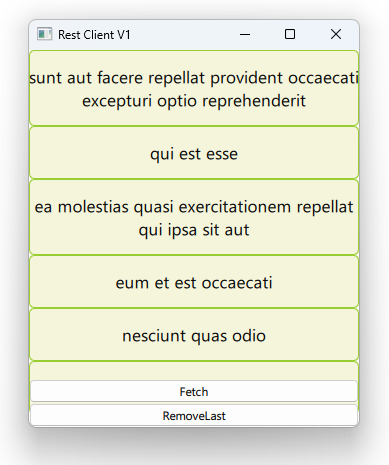

# Notes to self

        . A rest  client that :
            . Downloads data from the C++ side
            . Feeds the data to qml through contextProperties.
            . Everytime the data changes on the C++ side, you have
                to reset the context properties.

        . Break this in 2 steps [Take reference from the Qt 5 course] :
            . Downloading the data in C++
            . Feeding to qml
       
---

# Rest Client


---

# QNetworkAccessManager Machinery
```c++
void AppWrapper::fetchPosts()
{
    //Initialize our API data
    const QUrl API_ENDPOINT("https://jsonplaceholder.typicode.com/posts");

    QNetworkRequest request;
    request.setUrl(API_ENDPOINT);

    mNetReply = mNetManager->get(request);
    connect(mNetReply,&QIODevice::readyRead,this,&AppWrapper::dataReadyRead);
    connect(mNetReply,&QNetworkReply::finished,this,&AppWrapper::dataReadFinished);

}
```
---

```c++
            //Turn the data into a json document
            QJsonDocument doc = QJsonDocument::fromJson(*mDataBuffer);

            //Turn document into json array
            QJsonArray array = doc.array();

            for ( int i = 0; i < array.size(); i++)
            {
                QJsonObject object = array.at(i).toObject();
                QVariantMap map = object.toVariantMap();
                QString title = map["title"].toString();
                mPosts.append(title);

            }

            if(array.size() !=0){
                resetModel();
            }

            //Clear the buffer
            mDataBuffer->clear();
```

---

# Key : Reset the Model
```c++
void AppWrapper::resetModel()
{
    mEngine.rootContext()->setContextProperty("myModel",QVariant::fromValue(mPosts));
}
```

---

# QML
```qml
           ListView{
               id : mListView
               model : myModel//exposed from C++
               delegate: Rectangle{
                   Text {
                        //...
                       text : modelData
                       //...
                   }
               }
           }
```

---

# C++ : Removing Last
```qml
void AppWrapper::removeLast()
{
    if ( !mPosts.isEmpty()){
        mPosts.removeLast();
        resetModel();
    }
}
```


