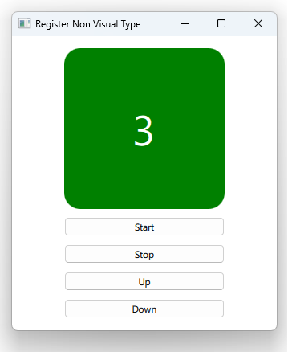

# Notes to self
        . Using qmlRegisterType to register C++ types into the QML system

                . The type becomes usable in QML like so :
                        Counter{
                            id : mCounter
                        }

                 . Properties decoarated with the Q_PROPERTY macro become accessible
                    through QML :
                        .             Text {
                                        id: mText
                                        text: mCounter.count // <<<<<==== We are accessing the count in QML
                                        anchors.centerIn: parent
                                        font.pointSize: 40
                                        color: "white"
                                    }

        . Use the Qt5 course as a reference and improvise.

       
---

# Custom Types : Counter


---

# Counter
```c++
class Counter : public QObject
{
    Q_OBJECT
    Q_PROPERTY(int count READ count WRITE setCount NOTIFY countChanged)
    Q_PROPERTY(bool up READ up WRITE setUp NOTIFY upChanged)
public:
    explicit Counter(QObject *parent = nullptr);
    int count() const;
    bool up() const;
    void setCount(int count);
    void setUp(bool up);
    //Helper methods
    Q_INVOKABLE void start();
    Q_INVOKABLE void stop();
signals:
    void countChanged(int count);
    void upChanged(bool up);
private :
    int m_count;
    bool m_up;
    QTimer * m_timer;
};
```
---

# Counter : Constructor
```c++
Counter::Counter(QObject *parent) : QObject(parent),
    m_count(0),
    m_up(true),
    m_timer(new QTimer(this))
{
    qDebug() << "Created Counter instance";
    m_timer->setInterval(500);
    connect(m_timer,&QTimer::timeout,[=](){

        if(m_up){
            ++m_count;
        }else{
            --m_count;
        }
        emit countChanged(m_count);//IMPORTANT FOR PROPERTY BINDINGS
    });
}
```

---

# main.cpp : Register the type
```c++
int main(int argc, char *argv[])
{
    QGuiApplication app(argc, argv);

    //Register the type
    qmlRegisterType<Counter>("com.blikoon.counter",1,0,"Counter");

    QQmlApplicationEngine engine;
    const QUrl url(u"qrc:/2-CustomTypesCounter/main.qml"_qs);
    engine.load(url);
    return app.exec();
}
```

---

# Use the Type in QML
```qml
    //import com.blikoon.counter 1.0
    import com.blikoon.counter
    Counter{
        id : mCounter
    }
    Column{
        Rectangle{
            color: (mCounter.count >= 0) ? "green": "red"
            Text {
                id: mText
                text: mCounter.count
            }
        }
        Button{
            text : "Start"
            onClicked: {
                mCounter.start()
            }
        }
    }
```

---

# Other buttons
```qml
        Button{
            text : "Stop"
            onClicked: {
                mCounter.stop()
            }
        }
        Button{
            text : "Up"
            onClicked: {
                mCounter.up = true;
            }
        }
        Button{
            text : "Down"
            onClicked: {
                mCounter.up = false;
            }
        }
```


