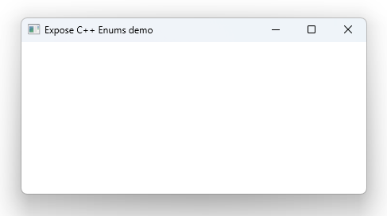

# Notes to self
        . Exploring  qmlRegisterUncreatableType
            . Taking advantage of that to show how to work with enums.

            . Show Q_GADGET : A lightweight version of Q_OBJECT
                . Show that Q_OBJECT works
                . I have  the
                    "Invalid QML element name "ErrorLevel";
                        value type names should begin with a lowercase letter"
                   error thatI haven't figured out the reason for yet.

        . Show what happens if one tries to create an uncreatable type
            . The error you set is 

       
---

# C++ Enums


---

# Enums : Q_OBJECT
```c++
#include <QObject>

class ErrorLevel : public QObject
{
    Q_OBJECT
public:
   explicit ErrorLevel(QObject *parent = nullptr);

    enum ErrorValue{
        INFORMATION,
        WARNING,
        DEBUG,
        MESSAGE
    };
    Q_ENUM(ErrorValue)
};
```

---

# Enums : Q_GADGET
```c++
class ErrorLevel
{
    Q_GADGET
public:
    explicit ErrorLevel();

    enum ErrorValue{
        INFORMATION,
        WARNING,
        DEBUG,
        MESSAGE
    };
    Q_ENUM(ErrorValue)
};
```

---

# main.cpp : Register Uncreatable Type
```c++
    qmlRegisterUncreatableType<ErrorLevel>("com.blikoon.errorlevel",1,0,"ErrorLevel",
                                              "Can not create ErrorLevel type in QML. Not allowed.");
```

---

# QML
```qml
import com.blikoon.errorlevel 1.0

Window {
    width: 640
    height: 480
    visible: true
    title: qsTr("Expose C++ Enums demo")

    //Showing what happens when one tries to create an uncreatable type.
    /*
    ErrorLevel{
    }
    */
       Component.onCompleted: {
           console.log(ErrorLevel.MESSAGE);
       }
}
```


