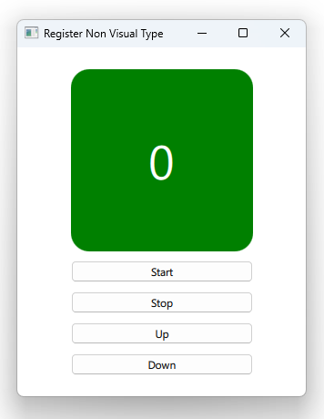

# Notes to self
        . A counter version that uses enums to control wheter
            we count up or down.

       
---

# Counter with C++ Enum


---

# The Enum
```c++
#include <QObject>

class Counting : public QObject
{
    Q_OBJECT
public:
    enum CountDirection {
        UP,
        DOWN
    };
    Q_ENUM(CountDirection)
private:
    explicit Counting(QObject *parent = nullptr);
};
```

---

# Counter
```c++
class Counter : public QObject
{
    Q_OBJECT
    //Q_PROPERTY(bool up READ up WRITE setUp NOTIFY upChanged)
    Q_PROPERTY(Counting::CountDirection  counting READ counting WRITE setCounting NOTIFY countingChanged)
public:
    explicit Counter(QObject *parent = nullptr);

    Counting::CountDirection counting() const;
    void setCounting(Counting::CountDirection counting);

    //Helper methods
    Q_INVOKABLE void start();
    Q_INVOKABLE void stop();
signals:
    void countingChanged(Counting::CountDirection counting);
private :
    int m_count;
    QTimer * m_timer;
    Counting::CountDirection m_counting;
};
```

---

# main.cpp : Register the types
```c++
    qmlRegisterType<Counter>("com.blikoon.counter",1,0,"Counter");
    qmlRegisterUncreatableType<Counting>("com.blikoon.counter",1,0,"Counting",
                                         "Can not instantiate Counting from QML.Not Allowed.");
```

---

# QML
```qml
       Counter{
           id : mCounter
       }
       Column{
           Rectangle{
               color: (mCounter.count >= 0) ? "green": "red"
               Text {
                   id: mText
                   text: mCounter.count
               }
           }
           Button{
               text : "Start"
               onClicked: {
                   mCounter.start()
               }
           }
       }
```


