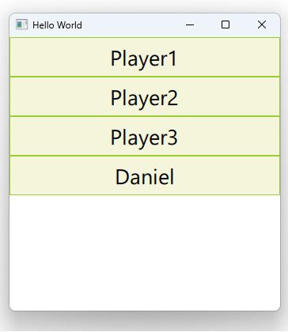

# Notes to self

        . Exploring default properties :
            . All you have to do is to add the macro :
                    Q_CLASSINFO("DefaultProperty","players")
                 to your class with list properties

            . You can then set up your team like so :

                              FootBallTeam {
                                id : team2
                                title: "APR"
                                coatch: "Coatch Name"
                                captain: Striker{
                                    name: "Captain"
                                    position: "Middle Field"
                                    playing: true
                                }

                                Defender{
                                    name: "Player4"
                                    position: "Middle Field"
                                    playing: true
                                }
                                Striker{
                                    name: "Player5"
                                    position: "Middle Field"
                                    playing: true
                                }
                                Defender{
                                    name: "Player6"
                                    position: "Middle Field"
                                    playing: true
                                }
                                Striker{
                                    name : "Daniel2"
                                    position: "None"
                                    playing: false
                                }
                            }


               . The qml engine will take the players and store them
                        in the players property.

                . The Q_CLASSINFO("DefaultProperty","players") macro is basically telling
                    the qml engine to take any element that's not explicitly assigned to
                    property and treat it as it is for the players property.

              . Use explanations from the Qt 5 course and improvise. 
---

# Default Properties


---

```qml
    FootBallTeam {
        id : team2
        title: "APR"
        coatch: "Coatch Name"
        captain: Striker{
            name: "Captain"
            position: "Middle Field"
            playing: true
        }

        Defender{
            name: "Player4"
            position: "Middle Field"
            playing: true
        }
        Striker{
            name: "Player5"
            position: "Middle Field"
            playing: true
        }
    }
```
---

```qml
    FootBallTeam {
        id : team1
        title: "Rayon Sports"
        coatch: "Coatch Name"
        captain: Striker{
            name: "Captain"
            position: "Middle Field"
            playing: true
        }

        players: [

            Defender{
                name: "Player1"
                position: "Middle Field"
                playing: true
            },
            Striker{
                name: "Player2"
                position: "Middle Field"
                playing: true
            }
        ]
    }
```

---

```c++
class FootBallTeam : public QObject
{
    Q_OBJECT

    Q_PROPERTY(QString title READ title WRITE setTitle NOTIFY titleChanged)
    Q_PROPERTY(QString coatch READ coatch WRITE setCoatch NOTIFY coatchChanged)
    Q_PROPERTY(Player * captain READ captain WRITE setCaptain NOTIFY captainChanged)
    Q_PROPERTY(QQmlListProperty<Player> players READ players  NOTIFY playersChanged)

    Q_CLASSINFO("DefaultProperty","players")

public:
    explicit FootBallTeam(QObject *parent = nullptr);
private : 
    QString m_title;
    QString m_coatch;
    Player * m_captain;
    QVector<Player*> m_players;
};
```


