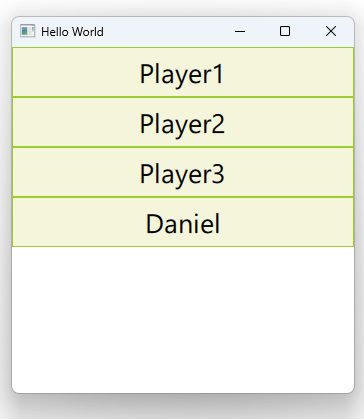

# Notes to self
    . Exploring the building of attached properties for your C++ types :
            . You have to provide :
                . An attached class
                . An attaching class

            . An attached class provides the bulk of the features. In our example
                we want to provide timing capabilities. The attached class,
                TimerAttached explses the [interval, running] properties :
                        Q_PROPERTY(int interval READ interval WRITE setInterval NOTIFY intervalChanged)
                        Q_PROPERTY(bool running READ running WRITE setRunning NOTIFY runningChanged)


            . The attached class provides the timing infrastructure using QTimer. Notice that
                we start and stop the timer when the running propery is set. It also emits
                the timerout signal at given intervals.

            . The attaching class has two requirements :

                . Providing a
                        static TimerAttached *qmlAttachedProperties(QObject * object);
                   method that returns an instance of the attached class,

                . Putting in the
                        QML_DECLARE_TYPEINFO(Timer,QML_HAS_ATTACHED_PROPERTIES)
                   macro, as seen in our Timer "attaching" class.

            . Once we have these class, we have to register them through the QML engine.
                Notice that the attached class isn't meant to be used externally so
                we expose it as uncreatable.

            . With the proper plumbing in place we can use our Timer attached property like so :

                       Person {
                           name : "Johnson"
                           age : 33

                           Timer.running : false
                           Timer.interval : 2000
                           Timer.onTimerOut : {
                               console.log("Timer out for person")
                           }
                       }

                       Rectangle {
                           id : mRect
                           width: 200
                           height: 200
                           color: "yellowgreen"

                           Timer.running : true
                           Timer.interval : 500
                           Timer.onTimerOut : {
                               console.log("Timer out for rect")
                           }
                       }

            . Play with the running and interval properties and show the console.log
                messages to really drive the point home.

            . Use the QT5 course as a reference and improvise.


 
---

# Attached Properties


---

# Attached Properties
* Attached Type
* Attaching Type

---

# Attached Type
*  Provides the bulk of the features.
*  Is used internally by Qt
*  Has a few coding reqirements

---

# The Goal
```qml
       Person {
           name : "Johnson"
           age : 33

           Timer.running : false
           Timer.interval : 2000
           Timer.onTimerOut : {
               console.log("Timer out for person")
           }
       }
```

---


# The Goal
```qml
       Rectangle {
           id : mRect
           width: 200
           height: 200
           color: "yellowgreen"

           Timer.running : true
           Timer.interval : 500
           Timer.onTimerOut : {
               console.log("Timer out for rect")
           }
       }
```

---


# Attached Type : TimerAttached
```c++
class TimerAttached : public QObject
{
    Q_OBJECT
    Q_PROPERTY(int interval READ interval WRITE setInterval NOTIFY intervalChanged)
    Q_PROPERTY(bool running READ running WRITE setRunning NOTIFY runningChanged)
public:
    explicit TimerAttached(QObject *parent = nullptr);
    int interval() const;
    bool running() const;
    void setInterval(int interval);
    void setRunning(bool running);
signals:
    void timerOut();
    void intervalChanged(int interval);
    void runningChanged(bool running);
private :
    QTimer * m_timer;
    int m_interval;
    bool m_running;
};
```

---


# Attached Type : TimerAttached
```c++
TimerAttached::TimerAttached(QObject *parent) : QObject(parent),
    m_timer(new QTimer(this)),
    m_interval(2000),
    m_running(false)
{
    qDebug() << "Creating the timer attached object";
    connect(m_timer,&QTimer::timeout,[=](){
        qDebug() << "Timeout for interval :" << m_interval;
        emit timerOut();

    });
}
```

---


# Attached Type : Starting and Stoping the Timer
```c++
void TimerAttached::setRunning(bool running)
{
    if (m_running == running)
        return;

    m_running = running;
    if (!m_running){
        m_timer->stop();
    }else{
        m_timer->start(m_interval);
    }
    emit runningChanged(m_running);
}
```

---


# Attaching Type : Timer
```c++
class Timer : public QObject
{
    Q_OBJECT
public:
    explicit Timer(QObject *parent = nullptr);

    static TimerAttached *qmlAttachedProperties(QObject * object);

signals:

public slots:
};
QML_DECLARE_TYPEINFO(Timer,QML_HAS_ATTACHED_PROPERTIES)
```

---


# Attached Type : TimerAttached
```c++
TimerAttached *Timer::qmlAttachedProperties(QObject *object)
{
    return new TimerAttached(object);
}
```

---


# Register the types
```c++
    qmlRegisterUncreatableType<TimerAttached>("com.blikoon.Football", 1,0, "TimerAttached",
                                   "Can not create TimerAttached in QML.Not allowed.");
    qmlRegisterType<Timer>("Timing",1,0,"Timer");
    qmlRegisterType<Person>("People", 1,0, "Person");
```

---


# Attached Type : TimerAttached
```c++
       Person {
           name : "Johnson"
           age : 33

           Timer.running : false
           Timer.interval : 2000
           Timer.onTimerOut : {
               console.log("Timer out for person")
           }
       }

       Rectangle {
           id : mRect
           width: 200
           height: 200
           color: "yellowgreen"

           Timer.running : true
           Timer.interval : 500
           Timer.onTimerOut : {
               console.log("Timer out for rect")
           }
       }
```


